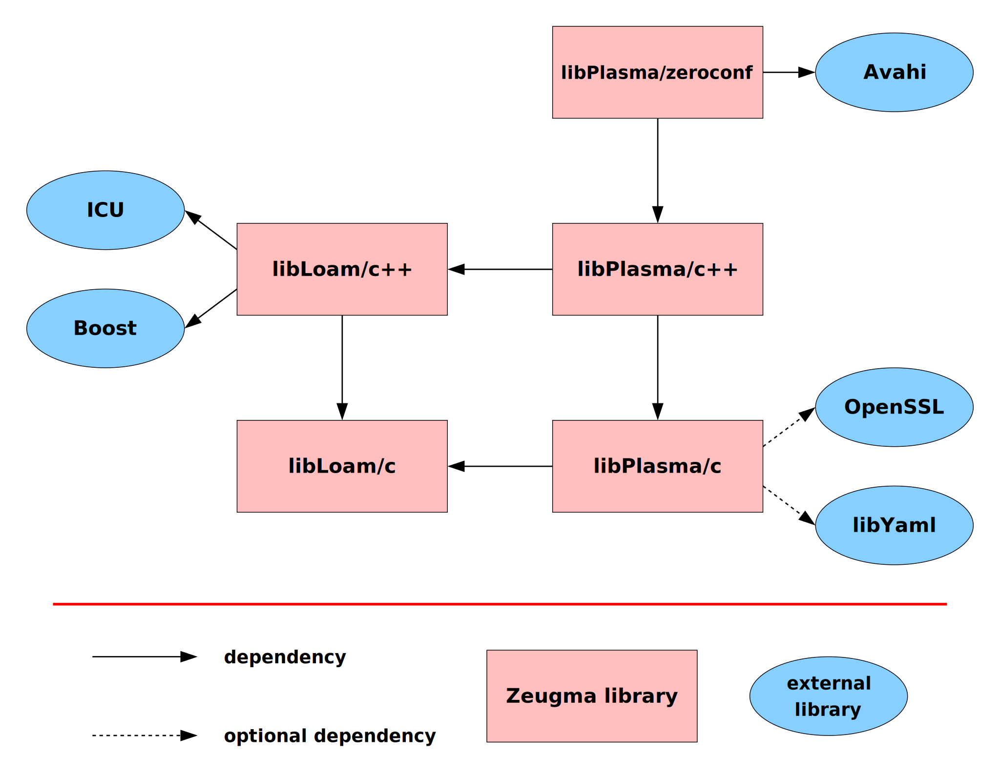

# Plasma

Plasma is a system for platform- and language-independent data
encapsulation and distributed, multipoint transmission. Its principal
implementations are in C and C++, though 'bindings' exist for (at
least) Java, Python, Javascript, Clojure (sort of), and Guile (mm!).

Arbitrarily complex -- in the senses of aggregation and nesting -- data
structures are represented by objects called 'Slawx' (the plural of 'Slaw')
and, when intended for cross-process relay, by elaborated Slawx called
'Proteins'. Slawx and Proteins are schemaless but self-describing, meaning
that a recipient can interrogate any of these objects to discover its
structure, the component data types at each sublocation, and of course the
data itself.

A process deposits Proteins into, and retrieves Proteins from, network-soluble
ring buffers called 'Pools'. Multiple processes can be simultaneously
connected (via 'Hoses') to a single pool, with each both depositing and
retrieving Proteins. The ordering of Proteins stored in a Pool is monotonic
and immutable, such that all retrieving processes observe the same
sequence. Processes most typically read from Pools in something like real
time, with Proteins being retrieved immediately after being deposited; but
Pools are also 'rewindable' so that, for example, a new process joining a
distributed system might attach to a Pool already in use and begin reading
Proteins from a time far enough in the past to be able to reconstruct system
context.

The Plasma framework embodies a philosophy of system design that appeals to an
endocrinology (rather than telegraphy) metaphor. The name 'Plasma' accordingly
refers not to the superheated & ionized intrastellar substance but rather to
the liquid medium by which biological organisms' messaging molecules are
transported and diffused.

# Libraries in this repository



**libLoam** is a library which contains basic portability and utility functions.  **libPlasma** is the library which implements slawx and pools, and is built on top of libLoam.

Both loam and plasma consist of a core library written in C, and an optional library written in C++.  The C++ library provides a C++ interface to the C library, and in some cases also adds additional functionality.

# building the thing

## Docker and Make Build

Platforms that can muster Docker and Make can do:

    make docker-build

Once built, you can open a shell into the built image with:

    make shell

This repo is mounted to `/work` within the shell. The plasma binaries are on the PATH (`p-list`, `p-create`, and friends).

## CMake and Ninja Build

Natively building Plasma requires these dependencies:

- ninja
- cmake
- libyaml
- boost
- icu4c
- openssl
- libavahi-client-dev (on linux)

Use your package manager (brew, apt, yum, zypper, etc) to install them.

To build on Linux/Intel MacOS, assuming you're in the same directory as
this README:

- `mkdir build`
- `cd build`
- `cmake -GNinja ..`
- `ninja`

Building on Apple Silicon is a bit more complicated:

- `brew install ninja cmake libyaml boost icu4c openssl`
- `export CXXFLAGS="-I/opt/homebrew/opt/openssl@3/include -I/opt/homebrew/opt/icu4c/include"`
- `export CFLAGS="-I/opt/homebrew/opt/openssl@3/include -I/opt/homebrew/opt/icu4c/include"`
- `export LDFLAGS="-L/opt/homebrew/opt/openssl@3/lib -L/opt/homebrew/opt/icu4c/lib -L/opt/homebrew/lib"`
- `mkdir build`
- `cd build`
- `cmake -GNinja ..`
- `ninja`

... aaaaaand it gets even worse, with versions of OSX (yeah, that's
what this sentence calls it) at 13.6 or later, or with the M2 chip, or
both, or something. Anyway, somewhere along the way homebrew starts
putting `yaml` in a different place, requiring the further
enbloatening of the compile (but not link) environment variables with
`-I/opt/homebrew/opt/libyaml/include` -- that is, replace the first
two in the sequence above with the following:

- `export CXXFLAGS="-I/opt/homebrew/opt/openssl@3/include -I/opt/homebrew/opt/libyaml/include -I/opt/homebrew/opt/icu4c/include"`
- `export CFLAGS="-I/opt/homebrew/opt/openssl@3/include -I/opt/homebrew/opt/libyaml/include -I/opt/homebrew/opt/icu4c/include"`


*N.B.*: it's not a problem to use the two overspecified compilation
flags-exports foregoing with an Apple Silicon machine for which the
simpler one would suffice.

## Installing

If you wish to install Plasma, you can specify the target install path with `CMAKE_INSTALL_PREFIX`, as well as `CMAKE_INSTALL_LIBDIR`. To install to the directory `/opt/plasma`, follow these steps:

```
cd build
cmake -GNinja -D CMAKE_INSTALL_PREFIX=/opt/plasma -D CMAKE_INSTALL_LIBDIR=/opt/plasma/lib ..
sudo mkdir /opt/plasma
sudo chown -R `id -u`:`id -g` /opt/plasma
ninja install
```